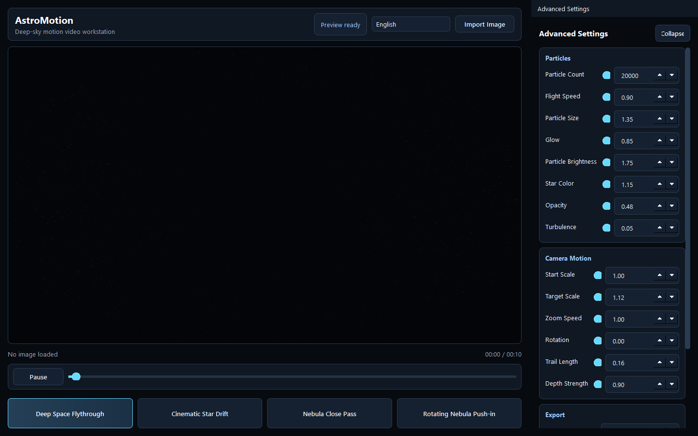

# AstroMotion

[中文说明](README.zh-CN.md)

AstroMotion is a desktop post-production tool for turning static deep-sky
photography into cinematic motion videos. Import a JPG, PNG, TIFF, or FITS
image, add subtle 3D star-particle motion, preview the result in real time, and
export an MP4 video.

Recommended GitHub repository name: **`AstroMotion`**  
Python package name: **`astromotion`**



## Highlights

- Modern dark PySide6 desktop interface for astrophotography workflows.
- OpenGL preview canvas with realtime particle rendering.
- Presets for deep-space flythrough, cinematic star drift, close nebula pass,
  and rotating nebula push-in.
- Advanced controls for particle count, speed, size, glow, brightness, color,
  opacity, turbulence, zoom, rotation, trails, depth, duration, FPS, and export
  resolution.
- Video-style preview controls with play/pause and a draggable timeline.
- Chinese/English runtime language switching from the top toolbar.
- Export resolution choices for 2K, 4K, or matching the imported image.
- Color-fidelity MP4 export path using FFmpeg RGB/full-range encoding.
- Portable Windows release workflow with bundled FFmpeg support.

## Quick Start

### Option 1: Use the Portable Windows Build

1. Download `AstroMotion-V2.0-windows-x64.zip` from the GitHub Releases page.
2. Extract the full folder.
3. Double-click `AstroMotion.exe`.
4. Keep the extracted folder intact; do not move only the `.exe`.

### Option 2: Run from Source

```powershell
py -m pip install -e .[fits]
py -m astromotion.app
```

In this workspace, the prepared virtual environment can be launched directly:

```powershell
.\.venv\Scripts\python.exe -m astromotion.app
```

## Basic Workflow

1. Click **Import Image** and select a deep-sky photo.
2. Choose a preset such as **Deep Space Flythrough** or
   **Rotating Nebula Push-in**.
3. Press **Play** or drag the timeline to preview the motion.
4. Fine-tune the right-side **Advanced Settings** panel:
   - **Particles**: density, speed, size, glow, brightness, color, opacity.
   - **Camera Motion**: start scale, target scale, zoom speed, rotation,
     trail length, and depth strength.
   - **Export**: duration, frame rate, and output resolution.
5. Click **Render Video** and choose an MP4 output path.

## Export Notes

AstroMotion prioritizes preserving the original photo color. The default export
path uses FFmpeg with RGB/full-range encoding to avoid the obvious color shifts
that can happen with common YUV 4:2:0 video paths.

For best results:

- Use the portable build or install FFmpeg locally.
- Use 2K export for fast previews.
- Use 4K or Match Source for final delivery.
- Keep particle opacity and glow moderate when the photo should remain the
  visual focus.

## Build a Portable Release

Install the release dependencies, then run:

```powershell
py -m pip install -e .[fits,release]
.\.venv\Scripts\python.exe scripts\build_release.py
```

The release package is written to:

```text
release/AstroMotion-V2.0-windows-x64.zip
```

For GitHub, upload this ZIP to a GitHub Release instead of committing it to the
source repository.

## Development

Run tests:

```powershell
py -m unittest discover -s tests
```

Compile-check the package:

```powershell
py -m compileall astromotion tests scripts
```

## Project Structure

```text
astromotion/
  app.py                    # Application entry point
  presets.py                # Particle and camera-motion presets
  i18n.py                   # Chinese/English runtime text
  engine/                   # Particle buffers, camera helpers, color sampling
  export/                   # Render worker, offscreen renderers, video encoder
  media/                    # Image/FITS/texture loading
  shaders/                  # OpenGL shaders
  ui/                       # Main window, preview widget, settings panel, theme
tests/                      # Unit and regression tests
scripts/build_release.py    # Windows portable package builder
```

## License

No open-source license has been selected yet. Add a `LICENSE` file before
accepting external contributions.
