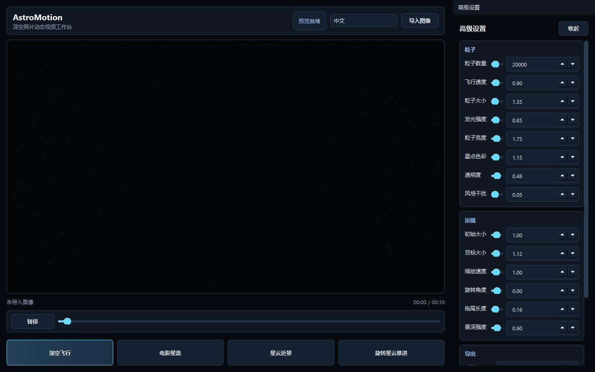

# AstroMotion

[English README](README.md)

AstroMotion 是一款面向深空摄影后期的桌面软件。它可以把静态星云、星系、深空照片转换为带有 3D 星点粒子、推近运镜、旋转运镜和拖尾氛围的动态 MP4 视频。

推荐 GitHub 仓库名：**`AstroMotion`**  
Python 包名：**`astromotion`**



## 功能亮点

- 基于 PySide6 的现代深色桌面界面，适合深空摄影后期工作流。
- OpenGL 实时预览画布，支持动态星点粒子效果。
- 导入照片后自动提取真实星点，星点不足时回退到生成星场。
- 真实星点动效会读取照片里的星点位置、颜色和亮度，把原图星点转换为可运动粒子，而不是只依赖随机生成星场。
- 内置深空飞行、电影星流、星云近景、旋转星云推进等预设。
- 高级参数可调：粒子数量、飞行速度、粒子大小、发光强度、粒子亮度、星点色彩、透明度、风场干扰、真实星点识别敏感度、真实星点强度、照片缩放、旋转角度、拖尾长度、景深强度、时长、帧率和导出分辨率。
- 类视频播放器的预览控制：播放、暂停、拖动时间进度条。
- 顶部工具栏支持中文/英文即时切换。
- 导出分辨率支持 2K、4K、跟随原图。
- 默认使用 FFmpeg H.264/AVC + 8-bit `yuv420p` 兼容编码，适合播放器和社交平台转码。
- 提供 Windows 便携版打包流程，可生成可直接分发的 ZIP。

## 快速开始

### 方式一：使用 Windows 便携版

1. 从 GitHub Releases 下载 `AstroMotion-V3.0-windows-x64.zip`。
2. 解压完整文件夹。
3. 双击 `AstroMotion.exe`。
4. 请保持解压后的文件夹结构完整，不要只移动单独的 `.exe` 文件。

### 方式二：从源码运行

```powershell
py -m pip install -e .[fits]
py -m astromotion.app
```

在当前开发工作区中，也可以直接使用已经准备好的虚拟环境：

```powershell
.\.venv\Scripts\python.exe -m astromotion.app
```

## 基本使用流程

1. 点击 **导入图像**，选择 JPG、PNG、TIFF 或 FITS 深空照片。AstroMotion 会在照片中自动提取真实星点。
2. 选择一个预设，例如 **深空飞行** 或 **旋转星云推进**。
3. 点击 **播放**，或拖动时间进度条预览任意时间点的效果。
4. 在右侧 **高级设置** 中微调参数：
   - **粒子**：数量、速度、大小、发光、亮度、色彩、透明度。
   - **真实星点**：识别敏感度、真实星点强度。
   - **运镜**：初始大小、目标大小、缩放速度、旋转角度、拖尾长度、景深强度。
   - **导出**：时长、帧率、导出分辨率。
5. 点击 **一键渲染导出**，选择 MP4 输出路径。

## 真实星点动效

AstroMotion 可以直接把你导入照片里的真实星点作为运动来源。导入深空照片后，程序会分析背景星点，识别点状恒星，采样每个星点的颜色和亮度，并把这些真实来源星点转换成可运动的粒子。

这样生成的动态星场会跟随原图里的真实星点分布，而不是完全随机生成。提取出的真实星点支持推近景深运动、旋转、拖尾、发光和强度调节。预览和 MP4 导出使用同一份提取星点数据，所以最终导出效果会和预览保持一致。

如果图片里可识别星点太少，AstroMotion 会自动回退到生成式景深星场。可以在右侧 **真实星点** 设置中调整识别敏感度和真实星点强度。

## 导出说明

AstroMotion 默认使用面向社交平台和通用播放器的 MP4 编码路径：H.264/AVC 视频、8-bit `yuv420p`、BT.709 色彩元数据、limited-range 视频电平，以及 `faststart` MP4 元数据。这样可以避免部分播放器或社交平台不支持 RGB / 4:4:4 H.264 时出现整屏发绿、无法解码或转码失败。

建议：

- 使用便携版，或在本机安装 FFmpeg。
- 快速预览时使用 2K。
- 最终成片时使用 4K 或跟随原图。
- 如果希望照片仍然是主体，请适度降低粒子透明度和发光强度。

## 构建 Windows 便携发行包

安装发行依赖后运行：

```powershell
py -m pip install -e .[fits,release]
.\.venv\Scripts\python.exe scripts\build_release.py
```

生成的发行包位于：

```text
release/AstroMotion-V3.0-windows-x64.zip
```

上传 GitHub 时，建议把这个 ZIP 放到 GitHub Releases，不要直接提交到源码仓库。

## 开发与测试

运行单元测试：

```powershell
py -m unittest discover -s tests
```

执行编译检查：

```powershell
py -m compileall astromotion tests scripts
```

## 项目结构

```text
astromotion/
  app.py                    # 应用入口
  presets.py                # 粒子与运镜预设
  i18n.py                   # 中英文运行时文本
  engine/                   # 粒子缓冲、相机、颜色采样
  export/                   # 渲染线程、离屏渲染、视频编码
  media/                    # 图像/FITS/纹理加载
  shaders/                  # OpenGL Shader
  ui/                       # 主窗口、预览画布、设置面板、主题
tests/                      # 单元测试和回归测试
scripts/build_release.py    # Windows 便携包构建脚本
```

## 开源协议

当前还没有选择开源协议。如果后续希望接受外部贡献，请先添加 `LICENSE` 文件。
